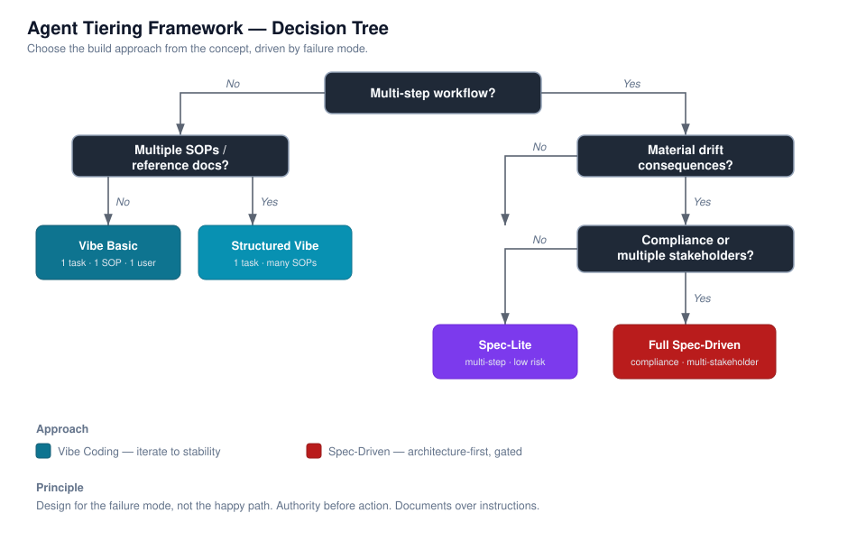

# Agent Tiering Framework

**A decision framework for choosing the right build approach for an AI agent — before you write a single instruction.**



Most AI agents fail for one of two reasons: they are *over-engineered* (a simple task buried under architecture it never needed) or *under-engineered* (a compliance-critical workflow shipped as a loose prompt that drifts). This framework fixes that by making one decision explicit and repeatable: **given the concept, what kind of application should you actually build?**

You describe an agent idea. The framework classifies it into one of four tiers based on workflow complexity, drift consequence, and stakeholder/compliance exposure — then hands you the matching design method, instruction template, and reference-document structure.

---

## The core idea

Two design philosophies sit at opposite ends of a spectrum:

| | Vibe Coding | Spec-Driven |
|---|---|---|
| **Optimizes for** | Speed to deployment | Correctness and reproducibility |
| **Handles drift by** | Correcting it iteratively | Preventing it by architecture |
| **Knowledge lives in** | Flat reference files | Layered document hierarchy |
| **Best when** | Single concern, low stakes | Multi-phase, compliance-bound |

Between them are four practical tiers:

| Tier | Approach | Use when |
|------|----------|----------|
| **Vibe Basic** | Vibe | Single task, one SOP, single user |
| **Structured Vibe** | Vibe | Single task, multiple SOPs, single user |
| **Spec-Lite** | Spec-Driven | Multi-step workflow, low compliance risk |
| **Full Spec-Driven** | Spec-Driven | Multi-step, compliance-bound, multi-stakeholder |

---

## The decision tree

```
START: What does this agent need to do?
  |
  +-- Multi-step workflow?
  |     |
  |     +-- NO --> Multiple SOPs / reference docs?
  |     |            +-- NO  --> Vibe Basic
  |     |            +-- YES --> Structured Vibe
  |     |
  |     +-- YES --> Does drift have material consequences?
  |                   +-- NO  --> Spec-Lite
  |                   +-- YES --> Compliance req. or multiple stakeholders?
  |                                 +-- NO  --> Spec-Lite
  |                                 +-- YES --> Full Spec-Driven
```

The rendered diagram is at [`assets/decision-tree.svg`](assets/decision-tree.svg).

---

## Why it matters

- **Design for the failure mode, not the happy path.** The tier is chosen by what happens when things go wrong, not when they go right.
- **Authority before action.** Define what the agent *can* and *cannot* decide before specifying what it does.
- **Documents over instructions.** Instructions define identity, hierarchy, and workflow. Reference documents hold domain knowledge. Keep instructions lean.
- **The spec is the source of truth.** For Spec-Driven agents, when output diverges from spec, the spec wins — regenerate to conform.

---

## Repository layout

```
agent-design-framework/
├── README.md                        ← you are here
├── docs/
│   ├── framework-reference.md        ← full methodology: tiers, phases, checklists
│   ├── worked-example.md             ← a complex idea → Full Spec-Driven
│   └── worked-example-vibe.md        ← a simple idea → Vibe Basic (the contrast)
├── templates/
│   ├── vibe-instruction-template.md  ← paste-ready instruction skeleton (Vibe)
│   └── spec-instruction-template.md  ← paste-ready instruction skeleton (Spec-Driven)
└── assets/
    └── decision-tree.svg             ← rendered decision diagram
```

---

## How to use it

1. **Read** [`docs/framework-reference.md`](docs/framework-reference.md) once to understand the tiers.
2. **Classify** your agent idea with the decision tree above.
3. **Design** using the phases for your tier (3 phases for Vibe, 4 for Spec-Driven).
4. **Start** from the matching template in [`templates/`](templates/).
5. **Migrate** tiers as an agent's stakes change — see the migration indicators in the reference.

Two end-to-end walkthroughs show the range: a complex idea taken to Full Spec-Driven in [`docs/worked-example.md`](docs/worked-example.md), and a simple idea taken to Vibe Basic in [`docs/worked-example-vibe.md`](docs/worked-example-vibe.md).

---

## Status & scope

This is a **design philosophy and decision aid**, not an empirical study. The tier model and migration heuristics reflect practical experience building and maintaining a portfolio of task and compliance agents; they are offered as reusable structure, not measured benchmarks.

## License

MIT — see `LICENSE`.
